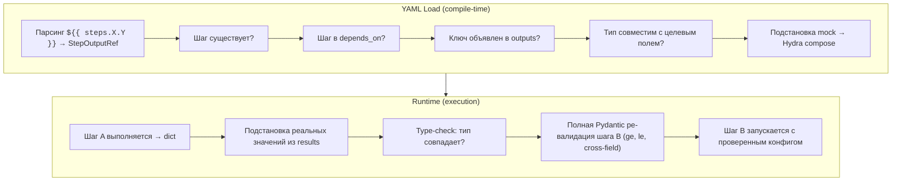

# dagster_dsl

Декларативный DSL для оркестрации модулей через Dagster.  
Определяет пайплайны как YAML-файлы или Python-код, с автоматической валидацией, Hydra-конфигурацией и runtime-подстановкой выходов между шагами.

---

## Быстрый старт

### Python DSL

```python
from dagster_dsl import pipeline

with pipeline("habr_full") as p:
    parse  = p.step("document_parser.parse_csv", input_file="data/articles.csv")
    raptor = p.step("raptor_pipeline.run").after(parse)

job = p.to_dagster_job()
```

### YAML Pipeline

```yaml
name: habr_full_pipeline
config:
  stores.neo4j.uri: bolt://prod:7687
steps:
  parse:
    module: document_parser.parse_csv
    config:
      input_file: data/articles.csv
      output_dir: parsed_yaml
  raptor:
    module: raptor_pipeline.run
    depends_on: [parse]
```

```python
from dagster_dsl import load_pipeline_yaml, run_pipeline

builder = load_pipeline_yaml("pipeline.yaml")
results = run_pipeline(builder)
```

---

## Ссылки между шагами (`StepOutputRef`)

### Проблема

Часто результат одного шага нужен как входной параметр другому. Например, парсер создаёт файлы в директории, а следующий шаг RAPTOR должен их оттуда прочитать. Без механизма ссылок приходится хардкодить пути.

### Решение

Синтаксис `${{ steps.<step_id>.<output_key> }}` позволяет **декларативно** передать выходы одного шага в конфиг другого. DSL валидирует ссылки при загрузке, а подставляет реальные значения в runtime.

### Объявление выходов

Каждый шаг может объявить, какие именованные значения он возвращает, через секцию `outputs`:

```yaml
steps:
  parse:
    module: document_parser.parse_csv
    config:
      input_file: data/articles.csv
      output_dir: parsed_yaml
    outputs:                    # ← декларация: что вернёт шаг
      output_dir: str           #    ключ → тип
      file_count: int
      files: list
```

Шаг `parse` должен вернуть `dict` с теми же ключами:

```python
@register_step("document_parser.parse_csv", ...)
def parse_csv(cfg):
    # ... парсинг ...
    return {
        "output_dir": str(cfg.output_dir),  # совпадает с outputs.output_dir
        "file_count": len(parsed_files),    # совпадает с outputs.file_count
        "files": parsed_files,              # совпадает с outputs.files
    }
```

### Использование ссылок

Другой шаг ссылается на эти выходы через `${{ steps.<id>.<key> }}`:

```yaml
steps:
  parse:
    module: document_parser.parse_csv
    config:
      input_file: data/articles.csv
      output_dir: parsed_yaml
    outputs:
      output_dir: str
      file_count: int

  raptor:
    module: raptor_pipeline.run
    depends_on: [parse]                              # ← обязательно!
    config:
      input_dir: "${{ steps.parse.output_dir }}"     # ← ссылка на str
      expected_files: "${{ steps.parse.file_count }}" # ← ссылка на int
```

### Полный пример: трёхшаговый пайплайн

```yaml
name: full_rag_pipeline

config:
  stores.neo4j.uri: bolt://localhost:7687
  stores.neo4j.password: secret

steps:
  # 1. Парсинг CSV → YAML-файлы
  parse:
    module: document_parser.parse_csv
    config:
      input_file: data/articles.csv
      output_dir: parsed_yaml
    outputs:
      output_dir: str
      file_count: int

  # 2. RAPTOR pipeline — принимает директорию из parse
  raptor:
    module: raptor_pipeline.run
    depends_on: [parse]
    config:
      input_dir: "${{ steps.parse.output_dir }}"
    outputs:
      chunks_count: int
      concepts_count: int

  # 3. Retrieval — используем результат RAPTOR
  search:
    module: retrieval.search
    depends_on: [raptor]
    config:
      query: "Что такое RAG?"
      top_k: 10
```

### Валидация при загрузке (Load-time)

DSL проверяет ссылки **до запуска** пайплайна. Ошибки возникают мгновенно:

#### 1. Несуществующий шаг

```yaml
config:
  input_dir: "${{ steps.unknown_step.output_dir }}"
```
```
ValueError: Step 'raptor': Ссылка на неизвестный шаг 'unknown_step' в '${{ steps.unknown_step.output_dir }}'
```

#### 2. Шаг не в `depends_on`

```yaml
steps:
  raptor:
    module: raptor_pipeline.run
    # depends_on: [parse]  ← забыли!
    config:
      input_dir: "${{ steps.parse.output_dir }}"
```
```
ValueError: Step 'raptor': Шаг 'parse' должен быть в depends_on
```

#### 3. Ключ не объявлен в `outputs`

```yaml
steps:
  parse:
    outputs: {}  # ← пусто
  raptor:
    config:
      input_dir: "${{ steps.parse.output_dir }}"
```
```
ValueError: Step 'raptor': Шаг 'parse' не объявляет output 'output_dir'
```

#### 4. Несовместимые типы

```yaml
steps:
  parse:
    outputs:
      output_dir: str   # ← str

  raptor:
    config:
      max_concurrency: "${{ steps.parse.output_dir }}"  # ← поле ожидает int
```
```
ValueError: Step 'raptor': Несовпадение типов для 'max_concurrency'. 
Ожидается int, получено str от '${{ steps.parse.output_dir }}'
```

### Runtime валидация

После подстановки реальных значений DSL повторно прогоняет **полную Pydantic-валидацию** конфигурации. Это гарантирует что сложные ограничения (`ge=`, `le=`, cross-field validators) проверяются на настоящих данных:

```python
# Пример: RetrievalConfig.top_k имеет ограничение ge=1
# Если steps.parse.count вернёт 0 → ошибка в runtime

class RetrievalConfig(BaseModel):
    top_k: int = Field(10, ge=1)  # ← min 1
```

```yaml
steps:
  parse:
    outputs:
      count: int   # может быть 0!
  search:
    depends_on: [parse]
    config:
      top_k: "${{ steps.parse.count }}"  # если count=0 → ValueError в runtime
```

```
ValueError: Ошибка валидации конфига шага 'search' (retrieval.search) 
после подстановки ссылок: top_k: Input should be greater than or equal to 1
```

### Таблица совместимости типов

| `outputs` тип | Совместимые типы в целевой схеме |
|---|---|
| `str` | `str`, `Path`, `Optional[str]`, `Any` |
| `int` | `int`, `float`, `Optional[int]`, `Any` |
| `float` | `float`, `int`, `Optional[float]`, `Any` |
| `list` | `list[…]`, `Sequence[…]`, `Any` |
| `dict` | `dict[…]`, `Mapping[…]`, `Any` |
| `bool` | `bool`, `Any` |

### Архитектура: двухфазная валидация



---

## Секция `inputs` — явная передача данных между шагами

### Зачем

`config` с `${{ }}` ссылками подходит для подстановки **конфигурационных** значений. Но когда шаг должен получить **данные** от upstream-шага (путь к результату, список ID, количество обработанных записей), семантически это не конфигурация — это **входные данные**.

Секция `inputs` — декларативная альтернатива Custom Step Contexts для передачи данных через YAML.

### Синтаксис

```yaml
steps:
  parse:
    module: document_parser.parse_csv
    config:
      input_file: data/articles.csv
    outputs:
      output_dir: str
      file_count: int

  raptor:
    module: raptor_pipeline.run
    depends_on: [parse]
    inputs:                                           # ← NEW
      input_dir: "${{ steps.parse.output_dir }}"      # данные из upstream
      expected_files: "${{ steps.parse.file_count }}"
    config:                                           # ← статическая конфигурация
      max_concurrency: 4
```

### Правила приоритета

`inputs` мержится **поверх** `config` — входные данные побеждают:

```yaml
config:
  input_dir: "/default/path"    # ← будет перезаписано
inputs:
  input_dir: "${{ steps.parse.output_dir }}"  # ← победит
```

### Python DSL

```python
with pipeline("habr_full") as p:
    parse = p.step("document_parser.parse_csv", input_file="data/articles.csv")
    
    raptor = p.step("raptor_pipeline.run") \
              .after(parse) \
              .input(input_dir="${{ steps.parse.output_dir }}")
```

### Валидация

Секция `inputs` проходит **ту же валидацию**, что и `config`:
- Шаг существует? ✅
- В `depends_on`? ✅
- Ключ объявлен в `outputs`? ✅
- Типы совместимы? ✅
- Runtime ре-валидация после подстановки? ✅

### Сравнение механизмов передачи данных

| | `config` + refs | `inputs` | Custom Contexts |
|---|---|---|---|
| Где объявляется | YAML `config:` | YAML `inputs:` | Python `@register_step` |
| Семантика | Override конфигурации | Входные данные | Разделяемое состояние |
| Приоритет | Базовый | Поверх config | N/A (ContextVar) |
| Валидация | Полная | Полная | Через `@requires_step_context` |
| Видимость в YAML | ✅ | ✅ | ❌ (implicit) |

## Контексты выполнения (Custom Step Contexts)

Помимо явной передачи данных через `inputs` или `config` (где передаются базовые типы: строки, числа, списки), DSL поддерживает **неявную передачу сложных объектов** (разделяемое состояние, коннекты к БД, in-memory структуры) через механизм контекстов (Context-Oriented Programming).

### Принцип работы

Шаг может объявить, что он **предоставляет** определённый контекст (dataclass), и заполнить его во время своей работы. Другие шаги могут объявить, что они **требуют** этот контекст для своей работы. 

Контексты хранятся в стеке `ExitStack` (через `contextvars`) и остаются активными для всех **последующих (downstream)** шагов в графе.

### Пример: Объявление и использование

1. **Определение контекста** (обычный `dataclass`):
   ```python
   from dataclasses import dataclass

   @dataclass
   class ParseContext:
       parsed_files_count: int = 0
       temp_dir: str = ""
   ```

2. **Шаг-провайдер** (создаёт и заполняет контекст):
   ```python
   from dagster_dsl import register_step, current_step_ctx

   # Указываем context_class — этот контекст будет активирован ПЕРЕД запуском шага
   @register_step("document_parser.parse", context_class=ParseContext)
   def parse_documents(cfg):
       # Логика парсинга...
       
       # Получаем инстанс контекста, который DSL уже активировал для нас
       ctx = current_step_ctx(ParseContext)
       ctx.parsed_files_count = 10
       ctx.temp_dir = "/tmp/parsed"
       return {"status": "ok"}
   ```

3. **Шаг-потребитель** (требует контекст):
   ```python
   from dagster_dsl import requires_step_context

   @register_step("raptor_pipeline.run")
   @requires_step_context(ParseContext)  # Строгая проверка зависимостей!
   def run_raptor(cfg):
       # Читаем данные из контекста предыдущего шага
       ctx = current_step_ctx(ParseContext)
       print(f"Обрабатываем {ctx.parsed_files_count} файлов из {ctx.temp_dir}")
       return {"status": "ok"}
   ```

### Отражение в пайплайне

В YAML-конфигурации или Python DSL вам **нужно только указать правильный порядок выполнения** (через `depends_on` / `.after()`). DSL сам позаботится о том, чтобы контекст был активирован перед `parse_documents` и передан в `run_raptor`.

```yaml
steps:
  parse:
    module: document_parser.parse
  raptor:
    module: raptor_pipeline.run
    depends_on: [parse]  # Обязательно, чтобы ParseContext был готов до запуска raptor!
```

### Преимущества

1. **Типизация и Автодополнение:** Контекст — это dataclass. Внутри Python-кода вашего шага IDE будет знать все поля `ctx`.
2. **Инкапсуляция:** Вам не нужно прокидывать сложные Python-объекты (классы, pandas DataFrame и т.д.) через строковые YAML конфиги или возвращаемые словари `outputs`.
3. **Fail-Fast Валидация:** Если шаг `raptor` будет запущен, а шаг `parse` не отработал и не создал `ParseContext` (или вы забыли указать его в `depends_on`), пайплайн упадёт с понятной ошибкой до начала работы `raptor`:
   `❌ Шаг 'raptor_pipeline.run' требует контексты шагов: ParseContext. Отсутствуют: ParseContext.`

---

## Зарегистрированные модули

| Модуль | Шаг | Описание |
|---|---|---|
| `document_parser` | `parse_csv` | Парсинг CSV → YAML |
| `raptor_pipeline` | `run` | RAPTOR: chunking + summarization + embedding |
| `concept_builder` | `run` | Граф концептов из RAPTOR |
| `retrieval` | `search` | Мульти-источниковый RAG-поиск |
| `topic_modeler` | `train`, `add_article` | BERTopic: обучение и предсказание |
| `vault_parser` | `parse`, `list_tasks`, `search`, `stats`, `wellness`, `add_task`, `update_task`, `delete_task`, `create_note` | Obsidian vault |
| `vault_acl` | `check_access`, `filter_files` | Контроль доступа к файлам |
