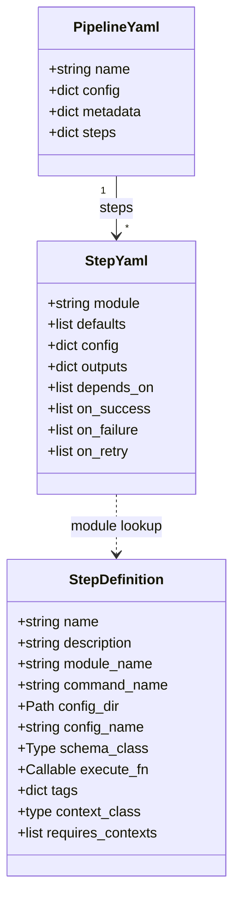
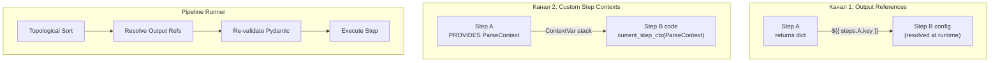

# Требования к UI/UX: Редактор пайплайнов (DAG Builder)

Этот инструмент проектируется не просто как "редактор графов", а как полноценный **оркестратор и DSL-среда**, надстроенная над Dagster. Ниже собрана суть фич, разбитая по уровням зрелости продукта. 

Главная идея: **Типы + валидация в реальном времени + двусторонняя синхронизация с YAML = инструмент разработки пайплайнов, а не просто рисовалка.**

---

## 1. Базовый уровень (Must-have)
Без этих функций UI останется лишь игрушкой:

* **Типовая система нод (Схемы)**  
  Каждый шаг (Step) строго типизирован (через JSON Schema). В UI форма параметров для ноды генерируется автоматически на базе её типа со строгой проверкой типов и дефолтными значениями.
* **Inline-валидация графа (Real-time)**  
  Ошибки показываются во время редактирования, а не после запуска: обнаружение циклов, отсутствующих обязательных зависимостей и несовместимых типов на ребрах (например, передача `DataFrame` в ноду, ожидающую `Model`).
* **Live YAML Preview (Бидирекциональная синхронизация)**  
  Двусторонний "Round-trip": визуальный интерфейс <-> YAML код. Все изменения графа мгновенно отражаются в YAML, а правки кода тут же перестраивают граф в UI. Источник истины — Git/YAML.
* **Версионирование**  
  Интеграция с Git: просмотр Diff-изменений между версиями графа и возможность отката к предыдущим рабочим версиям.

## 2. Уровень "Серьезный инструмент" (Serious)
Функции, обеспечивающие стабильность и переиспользуемость:

* **Контракты данных между нодами (Data Contracts)**  
  Ребра графа несут информацию о типах. Пользователь явно видит, какой тип/схема данных (например, `DataFrame[schema]`) передается от `Node A` к `Node B`. Несоответствия подсвечиваются.
* **Режим симуляции (Debug / Dry-run)**  
  Прогон графа без фактического выполнения для проверки порядка узлов и того, как отрендерились параметры на каждом шаге.
* **Шаблоны (Templates / Subgraphs)**  
  Возможность сохранять выделенные куски графа (например, "Блок Feature Engineering") для повторного использования в других пайплайнах.
* **Параметризация графа**  
  Поддержка динамических переменных конфигурации (например, `date: ${run_date}`), пресетов и переопределений для разных окружений (dev/prod).
* **Слой Секретов (Secrets Management)**  
  Ссылки на Vault или переменные окружения прямо из UI без сохранения чувствительных данных в генерируемый YAML.

## 3. Продвинутые фичи (Expert)
Задел на будущее развитие платформы:

* **Вложенные графы (Composition)** — drill-down в ноду, которая сама является графом.
* **Time Travel (Replay)** — перезапуск графа на исторических/старых данных для локализации регрессий.
* **Многопользовательская работа (Collaboration)** — совместное редактирование, блокировки и комментарии на нодах.
* **Анализ производительности (Performance Hints)** — советы от UI о "узких местах" графа и возможностях для параллелизма.

---

## 4. Конфигурация шагов (Config Management UX)

Конфигурация — **ключевой элемент** DAG-Builder. Каждый шаг в dagster-dsl несет сложный конфиг (Hydra + Pydantic), и UI обязан полностью поддерживать эту модель.

### 4.1. Архитектура конфигов (как устроено в dagster-dsl)

```
Pipeline YAML
├── name: "habr_full_pipeline"
├── config:      ◄── Глобальные override-ы (доступны всем шагам)
│   ├── log_level: INFO
│   └── stores:
│       ├── neo4j: { uri, user, password }
│       └── qdrant: { host, port }
├── metadata:    ◄── Метаданные (owner, schedule)
└── steps:
    ├── parse:
    │   ├── module: document_parser.parse_csv
    │   ├── config:     ◄── Step-level override-ы (приоритет над global)
    │   ├── defaults:   ◄── Hydra defaults (переключение сценариев)
    │   ├── outputs:    ◄── Декларация выходов (name → type)
    │   ├── depends_on: ◄── Зависимости
    │   └── on_success/on_failure/on_retry: ◄── Callbacks
    └── raptor:
        ├── module: raptor_pipeline.run
        ├── depends_on: [parse]
        └── config:
            └── stores.neo4j.password: "override" ◄── Точечное переопределение
```

### 4.2. Многослойность конфигурации (Config Layers)
Каждый шаг получает **итоговый конфиг**, собранный из нескольких слоев:

```
1. Module Defaults    (conf/config.yaml внутри модуля, загружается Hydra)
2. Hydra Defaults     (переключение сценариев, напр. embeddings: huggingface)
3. Global Overrides   (pipeline.config — фильтруется по Pydantic-схеме шага)
4. Step Overrides     (step.config — высший приоритет)
```

**Требования к UI:**
- **Панель конфигурации ноды (Step Config Panel)** — при клике на ноду открывается боковая панель с полной формой параметров, сгенерированной из `schema_class` (Pydantic модели) шага.
- **Цветовое кодирование источника (Source Badges)** — каждое значение в форме маркируется цветом-источником:
  - 🔵 `default` — значение из модуля по умолчанию.
  - 🟢 `step` — задано для этого конкретного шага.
  - 🟡 `global → step override` — глобальное значение перекрыто шагом.
  - 🔷 `global` — пришло из глобального конфига пайплайна.
- **Schema-aware фильтрация** — если глобальный конфиг содержит ключ `stores`, а у шага `document_parser` нет поля `stores` в Pydantic-схеме, UI должен визуально скрывать этот ключ (или показывать его затемненно: "не применяется к этому шагу").

### 4.3. Hydra Defaults (Переключение сценариев)
В dagster-dsl шаг может указывать Hydra `defaults` — импорт набора конфигов для переключения сценариев (например, выбор эмбеддинг-модели):

```yaml
parse:
  module: document_parser.parse_csv
  defaults:
    - embeddings: huggingface       # ← выбрать HuggingFace эмбеддинги
    - stores@stores.qdrant: qdrant  # ← пакетная конфигурация Qdrant
```

**Требования к UI:**
- **Dropdown / Selector** для каждого доступного "defaults-группы" (например: embeddings → `[huggingface, openai, local]`).
- При переключении UI мгновенно обновляет все зависимые поля формы, подтягивая новые дефолтные значения из выбранной конфигурации.
- Визуальный маркер "Hydra defaults" на ноде, чтобы было видно, что шаг использует не стандартный набор.

### 4.4. Передача данных между шагами (Inter-step Data Flow)

В dagster-dsl реализованы **два** механизма передачи данных между шагами. UI должен поддерживать оба.

#### Механизм 1: Output References (Config-level, `${{ steps.X.Y }}`)

Значения из результатов одного шага подставляются в конфигурацию другого **на этапе выполнения** (runtime). Шаг возвращает `dict`, а ссылка `${{ steps.parse.parsed_dir }}` вытягивает из него ключ `parsed_dir`.

```yaml
parse:
  module: document_parser.parse_csv
  outputs:
    parsed_dir: str        # ← декларация: "я верну ключ parsed_dir типа str"
  config:
    output_dir: parsed_yaml

raptor:
  module: raptor_pipeline.run
  depends_on: [parse]
  config:
    input_dir: ${{ steps.parse.parsed_dir }}   # ← подмена при выполнении
```

Что происходит в рантайме (`pipeline_runner._resolve_runtime_outputs`):
1. Шаг `parse` выполняется и возвращает `{"parsed_dir": "parsed_yaml", ...}`.
2. Перед запуском `raptor` строка `${{ steps.parse.parsed_dir }}` заменяется на `"parsed_yaml"`.
3. Конфиг **ревалидируется** Pydantic-схемой шага (constraints, cross-field validators).

**Требования к UI:**
- **Визуальные порты ввода/вывода (I/O Ports)** на каждой ноде:
  - Выходные порты — генерируются из `outputs` (маленькие круги справа с подписью `parsed_dir: str`).
  - Входные порты — генерируются из полей `config`, которые содержат `${{ }}` (маленькие круги слева).
- **Drag-and-drop wiring** — перетаскивание "провода" от выходного порта к полю конфигурации другой ноды автоматически создает `depends_on` + вставляет `${{ steps.X.Y }}`.
- **Тип на ребре** — подпись на визуальной стрелке показывает тип (`str`, `int`, `dict`).
- **Autocomplete** — при вводе `${{ ` в текстовом поле конфига выпадает список совместимых upstream-выходов.
- **Inline type mismatch** — красная подсветка, если тип выхода `str`, а целевое поле по Pydantic-схеме ожидает `int`.

#### Механизм 2: Custom Step Contexts (Code-level, COP)

Второй, более мощный канал — типизированные контексты шагов. Каждый шаг может **предоставлять** (`context_class`) и/или **требовать** (`requires_contexts`) типизированный dataclass-объект (Python `ContextVar`).

```
pipeline_context("habr_full")
  └─ custom_step_context(ParseContext())      ← шаг "parse" PROVIDES
       ├─ execute_step("parse")               ← заполняет ParseContext
       └─ custom_step_context(RaptorContext()) ← шаг "raptor" PROVIDES
            ├─ execute_step("raptor")          ← ЧИТАЕТ ParseContext + заполняет RaptorContext
            └─ execute_step("concepts")        ← ЧИТАЕТ оба контекста
```

Контексты живут на стеке (`ExitStack`): активируются до запуска шага и остаются доступными для всех последующих шагов через `current_step_ctx(ClassName)`.

**Отличие от Output References:**
| | Output References | Custom Contexts |
|---|---|---|
| Уровень | Config (YAML) | Code (Python) |
| Что передается | Конкретные значения (str, int, dict) | Полноценные объекты с состоянием |
| Когда разрешается | Runtime (подстановка перед запуском) | В процессе исполнения (вложенный стек) |
| Видимость в YAML | Да (`${{ steps.X.Y }}`) | Нет (implicit, задано в `@register_step`) |
| Применение | Конфиг-параметры (пути, ID, пороги) | Разделяемое состояние (соединения, контейнеры) |

**Требования к UI:**
- **Context badges на нодах** — визуальный маркер "Provides: `ParseContext`" и "Requires: `RaptorContext`" (иконки 📤/📥).
- **Implicit dependency warning** — если нода `B` требует `RaptorContext`, а нода `A` его предоставляет, но `A` не указана в `depends_on` у `B`, UI подсвечивает предупреждение.
- **Context Inspector** — при клике на бейдж контекста боковая панель показывает поля dataclass-а (такие как `max_concurrency`, `knowledge_graph_ready`), чтобы пользователь понимал, какие данные доступны downstream-шагам.

### 4.5. Callbacks (Palette + Настройка параметров)

В dagster-dsl есть singleton `CallbackRegistry` со встроенными и пользовательскими callbacks.

**Встроенные callbacks:**
| Имя | Параметры | Описание |
|---|---|---|
| `log_result` | — | Логирование результата/ошибки шага |
| `notify` | `message: str` | Вывод уведомления |
| `send_alert` | `channel: str` | Отправка алерта (Slack / email / PagerDuty) |
| `retry` | `max_attempts: int`, `delay: int` | Повтор шага при ошибке |

Пользовательские callbacks регистрируются через `@register_callback("name")`.

**Требования к UI:**
- **Palette / Picker** — на каждой ноде три раздела (on_success / on_failure / on_retry). Для добавления callback'а пользователь нажимает "+" и выбирает из dropdown-списка **всех зарегистрированных** callbacks (`CallbackRegistry.list_callbacks()`).
- **Автоформа параметров** — после выбора callback'а (например, `retry`) UI показывает мини-форму для его параметров (`max_attempts`, `delay`), сгенерированную из сигнатуры функции callback'а (или из его `params` в YAML-формате).
- **Визуальные маркеры** на ноде:
  - ⟳ — если настроен `retry`.
  - 🔔 — если настроен `notify` или `send_alert`.
  - ✓/✗ — индикаторы наличия обработчиков success/failure.
- **Превью поведения** — tooltip на ноде: "При ошибке: 3 попытки через 30с → алерт в #data-errors".

### 4.6. Глобальная панель конфигурации (Pipeline Config Panel)
Отдельная панель или модальное окно для редактирования `pipeline.config` (глобальные override-ы) и `pipeline.metadata`:
- Вложенный редактор (JSON/YAML tree editor) для `stores`, `log_level` и т.д.
- **Impact preview** — при изменении глобального значения UI показывает, какие шаги затронуты (т.к. не все шаги воспринимают все ключи из global из-за schema-aware фильтрации).

---

## 5. STRUCTURE.md (Модель данных dagster-dsl)

### Узлы (Ноды графа)



### Потоки данных между шагами


