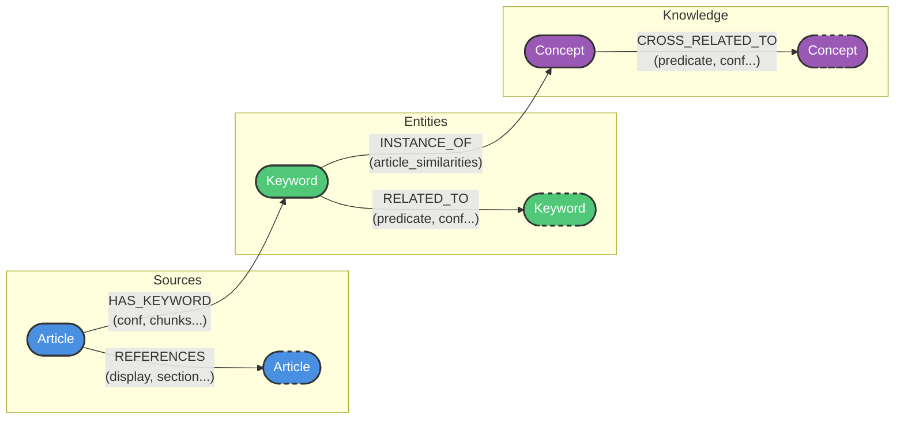
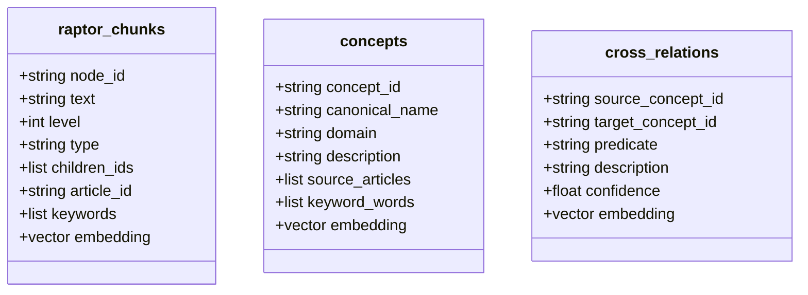

# Структура данных и связей (Knowledge Base)

В данном документе описана структура хранения данных в графовой базе данных **Neo4j** и векторном хранилище **Qdrant** для модулей `raptor_pipeline` и `concept_builder`. Эта информация необходима для проектирования интерфейса (UI/UX) базы знаний.

---

## 1. Структура в Neo4j (Графовые связи)

В Neo4j хранятся метаданные, извлеченные сущности и связи между ними.

### Узлы (Nodes)

1. **`Article`** (Документ/Статья)
   - `id` (string): Уникальный идентификатор статьи.
   - `article_name` (string): Название статьи.
   - `version` (string): Версия документа.
   - `summary` (string): Краткое содержание (сгенерировано LLM на основе RAPTOR-дерева).

2. **`Keyword`** (Ключевое слово / Сущность)
   - `word` (string): Само ключевое слово (в нижнем регистре, за исключением аббревиатур).
   - `category` (string): Категория сущности (например, "person", "organization", "reference", "other").

3. **`Concept`** (Концепт — результат кластеризации Keywords из нескольких статей)
   - `id` (string): Уникальный UUID концепта.
   - `canonical_name` (string): Основное название концепта (самое частотное слово в кластере, либо сгенерированное LLM).
   - `domain` (string): Предметная область концепта.
   - `description` (string): Обобщенное описание концепта.
   - `source_articles` (list[string]): Список ID статей, в которых встречается данный концепт.
   - `source_versions` (string/json): Версии исходных статей.
   - `keyword_words` (list[string]): Список исходных ключевых слов (`word`), образующих данный концепт.
   - `concept_group_id` (string): ID группы концептов при версионировании.
   - `version` (int): Версия концепта (для инкрементального обновления).
   - `is_active` (bool): Флаг активности.
   - `previous_version_id` (string): Ссылка на предыдущую версию.
   - `run_id` (string): ID запуска пайплайна, сформировавшего концепт.
   - `is_manual` (bool): Создан ли вручную.
   - `created_at`, `updated_at` (str): Таймстемпы в формате ISO.

### Связи (Edges / Relationships)

1. **`(:Article)-[:HAS_KEYWORD]->(:Keyword)`**
   - **Смысл**: Статья содержит данное ключевое слово.
   - Свойства:
     - `confidence` (float): Уверенность LLM при извлечении.
     - `chunk_ids` (list[string]): Список ID текстовых чанков (RAPTOR узлов), где это слово найдено.
     - `description` (string): Контекстное описание ключевого слова в рамках данной статьи.

2. **`(:Article)-[:REFERENCES]->(:Article)`**
   - **Смысл**: Одна статья ссылается на другую (кросс-ссылки, извлеченные из текста).
   - Свойства:
     - `section` (string): Раздел или якорь в целевой статье (опционально).
     - `display` (string): Текст ссылки (анкор), как он отображается.
     - `source_chunk_ids` (list[string]): Чанки, из которых осуществлена ссылка.
     - `version` (string): Версия ссылки\документа.

3. **`(:Keyword)-[:RELATED_TO]->(:Keyword)`**
   - **Смысл**: Семантическая связь между двумя сущностями внутри документа(ов).
   - Свойства:
     - `predicate` (string): Глагол или тип связи (например, "включает в себя", "разработал").
     - `confidence` (float): Уверенность модели в связи.
     - `description` (string): Текстовое пояснение связи.
     - `source_articles` (list[string]), `source_versions` (string/json): Источники, подтверждающие связь.

4. **`(:Keyword)-[:INSTANCE_OF]->(:Concept)`**
   - **Смысл**: Ключевое слово признано проявлением (инстансом) высокоуровневого концепта.
   - Свойства:
     - `article_similarities` (string/json): Мапа вида `{"article_id": similarity_score}`, показывающая семантическую близость описания ключевого слова в конкретной статье к общему описанию концепта.

5. **`(:Concept)-[:CROSS_RELATED_TO]->(:Concept)`**
   - **Смысл**: Обобщенная семантическая связь между двумя концептами на макроуровне (сформирована LLM или агрегирована из связанных Keywords).
   - Свойства:
     - `predicate` (string): Отношение.
     - `description` (string): Аргументация (почему они связаны).
     - `source_articles` (list[string]), `source_versions` (string/json), `confidence` (float). 

---

## 2. Структура в Qdrant (Векторное хранилище)

Векторное представление служит для семантического поиска, RAG и кластеризации. Qdrant хранит векторы (эмбеддинги) и payload (полезную нагрузку для фильтрации).

### Коллекция: `raptor_chunks`
- **Назначение**: Хранение RAPTOR-узлов (иерархического дерева фрагментов текста и их суммаризаций).
- **Payload** (поля документа):
  - `node_id` (string): Идентификатор узла (сгенерирован RAPTOR).
  - `text` (string): Собственно текст чанка или суммаризация дочерних узлов.
  - `level` (int): Уровень в дереве (0 — листовые чанки из оригинального текста, 1+ — промежуточные или корневые суммаризации).
  - `type` (string): Тип узла ("leaf", "summary", "root").
  - `children_ids` (list[string]): Ссылки на дочерние элементы дерева.
  - `article_id` (string): Привязка к исходной статье.
  - `keywords` (list[string]): Список связанных ключевых слов (массив слов `word`).

### Коллекция: `concepts`
- **Назначение**: Хранение эмбеддингов описаний высокоуровневых концептов. Семантический поиск по концептам.
- **Payload**:
  - `concept_id` (string): ID концепта (связь с Neo4j).
  - `canonical_name` (string): Название.
  - `domain` (string): Предметная область.
  - `description` (string): Описание концепта.
  - `source_articles` (list[string]): ID статей.
  - `keyword_words` (list[string]): Набор исходных ключевых слов.

### Коллекция: `cross_relations`
- **Назначение**: Хранение эмбеддингов описаний связей между концептами для поиска релевантных зависимостей.
- **Payload**:
  - `source_concept_id` (string): ID источника.
  - `target_concept_id` (string): ID цели.
  - `predicate` (string): Тип отношения.
  - `description` (string): Описание связи.
  - `confidence` (float): Уверенность.

---

## 3. Рекомендации для проектирования UI/UX (kb_ui)

Исходя из структуры, UI базы знаний должен обеспечивать:
1. **Поиск и навигацию**:
   - Текстовый/семантический поиск возможен как по "сырым" кускам текста (`raptor_chunks`), так и по высокоуровневым `concepts`.
   - Графовая визуализация: Показывать связи концептов (`CROSS_RELATED_TO`) и проваливаться от концепта вниз к конкретным ключевым словам (`INSTANCE_OF`) и статьям (`HAS_KEYWORD`).
2. **Иерархию чтения (RAPTOR)**:
   - Возможность читать краткое содержание (summary_nodes из `raptor_chunks` уровня > 0).
   - При необходимости — "раскрывать" узел, переходя к его `children_ids` (детализации текста).
3. **Traceability (Трассируемость)**:
   - Связи всегда имеют `source_articles` и `source_chunk_ids`. UI должен позволять кликнуть на любую связь/концепт и показать с какого абзаца (чанка) была извлечена эта информация.
4. **Кросс-документные ссылки**:
   - Отображать явные ссылки между статьями (по ребрам `REFERENCES`).

---

## 4. Архитектура обновления при изменении Vault-статей (Partial Updates)

Когда исходная статья в Vault (например, хранилище Obsidian) меняется, система должна запустить каскадное частичное обновление связанных данных, чтобы не пересчитывать всю базу с нуля.

### Этап 1: RAPTOR Pipeline (Апдейт чанков и сущностей)
1. **Дифференциация текста (Diffing)**: При обновлении файла вычисляется разница. Система находит устаревшие, измененные и добавленные куски текста (chunks).
2. **Точечная инвалидация дерева**: 
   - Векторные узлы из `raptor_chunks`, которые больше не актуальны, удаляются.
   - Мета-узлы (summary_nodes), построенные поверх удаленных чанков, пересчитываются (LLM генерирует новое саммари для измененной ветви).
3. **Обновление Keywords (Neo4j)**:
   - Узел `Keyword` связан с `Article` ребром `HAS_KEYWORD`, внутри которого хранится `chunk_ids`.
   - Если чанк удален, его ID убирается из связи. Если массив `chunk_ids` пустеет, то ребро удаляется. Если у `Keyword` не остается ребер в графе, он считается "сиротой" (Orphan) и удаляется или помечается неактивным.
   - Измененные куски текста запускают процесс извлечения (Extraction), добавляя новые связи или новые узлы `Keyword`.

### Этап 2: Concept Builder (Каскадное версионирование концептов)
1. **Детектирование (Stale Concepts)**: Любой `Concept`, у которого в массиве `source_articles` есть затронутая статья, проверяет поле `source_versions` (сохраненный хеш или версия на момент сборки концепта). Если текущая версия статьи не совпадает со снапшотом в концепте — узел помечается как `Stale/Outdated`.
2. **Расчет изменений**:
   - Исчезнувшие Keywords удаляются из выборки концепта (убирается ребро `INSTANCE_OF`).
   - Появляются новые Keywords из обновленной статьи, которые проходят скоринг векторной близости к вектору концепта.
3. **Эволюция Концепта**:
   - Автоматически или в ручном режиме (через UI) запускается команда `Expand`.
   - Генерируется новая версия концепта (v+1) с новым описанием, вбирающим в себя новые факты из обновленной статьи.
   - Старый `Concept` переводится в `is_active=false`, и возникает ребро `(old_concept)-[:EVOLVED_TO]->(new_concept)`.

### Следствие для UI
Побочным эффектом такого потока данных является то, что UI должен иметь функционал **"Inbox / Needs Review"** (Требует внимания). В этой корзине пользователь (human-in-the-loop) будет видеть список `Stale` концептов, у которых изменились фундаментные статьи, и одним кликом запускать для них резолв различий (diff review).
