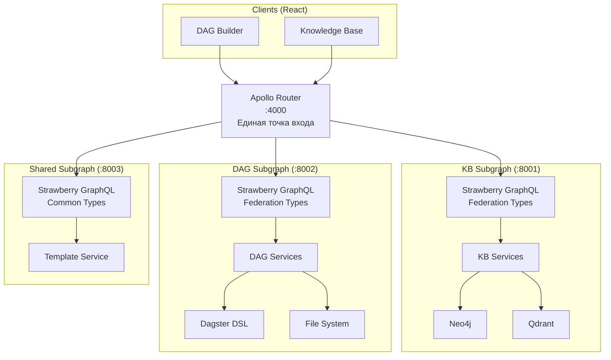
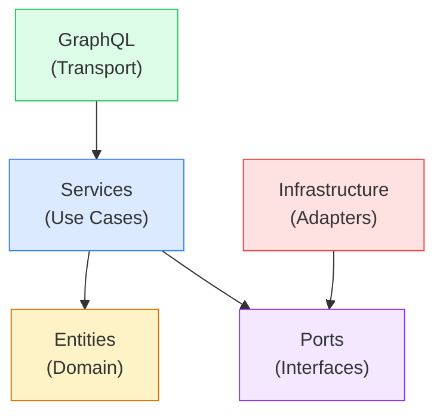

# Backend Architecture — Clean Architecture + GraphQL Federation v2

Серверная часть UI-платформы проектируется по принципам **Clean Architecture** (Чистая Архитектура) с **GraphQL Federation v2** для независимого масштабирования каждого микрофронтенда.

Референсная реализация паттернов: [`D:\project\graphql_book`](file:///D:/project/graphql_book) (Strawberry Federation, DataLoaders, Relay, Permissions, Subscriptions).

---

## 1. Почему GraphQL, а не REST

| Проблема REST | Решение GraphQL |
|---|---|
| **Over-fetching**: REST `/api/kb/concepts/{id}` возвращает ВСЁ | Query запрашивает ровно нужные поля |
| **N+1**: Для графа нужно 3+ round-trip-а (concepts → keywords → chunks) | **Один** query с вложенными резолверами + **DataLoaders** для батчинга |
| **Разные экраны — разные данные** | GraphQL fragments — каждый компонент описывает свой `fragment` |
| **Real-time** (Inbox / stale concepts) — REST требует polling | **Subscriptions** (WebSocket) — push при появлении stale-концепта |

## 2. Почему Federation, а не монолитный GraphQL

| Монолитный GraphQL | Federation v2 |
|---|---|
| Один сервис со всей схемой — растет в «God Service» | Каждый микрофронтенд имеет свой subgraph-сервис |
| Изменения в KB-схеме могут сломать DAG-сервис | Субграфы деплоятся **независимо** |
| Невозможно масштабировать компоненты по отдельности | KB-сервис можно масштабировать отдельно от DAG-сервиса |
| Добавление нового приложения требует рефактора всего бэкенда | Новый subgraph подключается **одной строкой** в `supergraph.yaml` |

---

## 3. Архитектура Federation



### 3.1. Router (Apollo Router)

Фронтенд обращается к **одному** URL (`/graphql`). Apollo Router:
1. Получает запрос от клиента.
2. По `supergraph.graphql` определяет, какие части запроса направить в какой subgraph.
3. Собирает ответы и возвращает клиенту.

```yaml
# federation/supergraph.yaml
federation_version: =2.11.2

subgraphs:
  kb:
    routing_url: http://kb-service:8001/graphql
    schema:
      subgraph_url: http://localhost:8011/graphql
  dag:
    routing_url: http://dag-service:8002/graphql
    schema:
      subgraph_url: http://localhost:8012/graphql
  shared:
    routing_url: http://shared-service:8003/graphql
    schema:
      subgraph_url: http://localhost:8013/graphql
```

### 3.2. Subgraphs — кто владеет какими типами

| Subgraph | Owns (основные типы) | Extends (расширяет) |
|---|---|---|
| **KB** (:8001) | `Article`, `Keyword`, `Concept`, `Chunk`, `GraphData` | — |
| **DAG** (:8002) | `StepDefinition`, `Pipeline`, `PipelineStep`, `ValidationError` | — |
| **Shared** (:8003) | `NodeAppearanceTemplate`, `UserPreferences` | `StepDefinition` (добавляет `appearance`) |

### 3.3. Entity Sharing (межсервисное расширение типов)

По образцу `reviews_service` из `graphql_book` — Shared-сервис **расширяет** тип `StepDefinition` из DAG-сервиса, добавляя поле `appearance`:

```python
# shared_service/schema.py — Stub-тип для StepDefinition
@strawberry.federation.type(keys=["name"])
class StepDefinition:
    name: str = strawberry.federation.field(external=True)

    @strawberry.field(description="Кастомный внешний вид для этого типа шага")
    async def appearance(self, info: Info) -> Optional[NodeAppearanceTemplateType]:
        svc = info.context.template_service
        return await svc.get_template_for_module(self.name)

    @classmethod
    async def resolve_reference(cls, info: Info, name: str) -> "StepDefinition":
        return cls(name=name)
```

Когда фронтенд запрашивает `{ steps { name jsonSchema appearance { icon color } } }`, Router направляет: `name + jsonSchema` → DAG-сервис, `appearance` → Shared-сервис.

---

## 4. Clean Architecture — внутри каждого Subgraph

Каждый subgraph-сервис следует одной и той же Clean Architecture. Пример для **KB Subgraph**:

```
kb_service/                          ← Subgraph 1
├── main.py                          ← FastAPI + Strawberry Federation Schema
├── context.py                       ← Request context (user, loaders, DB sessions)
│
├── domain/                          ← 🧠 Слой 1: Бизнес-логика
│   ├── entities/
│   │   ├── concept.py               ← Concept, ConceptVersion (Pydantic)
│   │   ├── keyword.py               ← Keyword, KeywordScore
│   │   ├── article.py               ← Article, ArticleMeta
│   │   └── chunk.py                 ← RaptorChunk, ChunkSnapshot
│   ├── services/
│   │   ├── kb_service.py            ← expand, create, detect_stale
│   │   └── graph_service.py         ← Сборка подграфов для визуализации
│   └── ports/
│       ├── graph_repo.py            ← ABC: get_concepts, get_neighbors...
│       └── vector_repo.py           ← ABC: search_chunks, get_by_ids...
│
├── infrastructure/                  ← 🔌 Слой 2: Адаптеры
│   ├── neo4j/
│   │   ├── neo4j_graph_repo.py
│   │   └── queries.py               ← Cypher-запросы
│   ├── qdrant/
│   │   └── qdrant_vector_repo.py
│   └── config.py
│
├── graphql/                         ← 📡 Слой 3: Transport
│   ├── schema.py                    ← strawberry.federation.Schema(Query, Mutation, Subscription)
│   ├── types/
│   │   ├── concept_type.py          ← @strawberry.federation.type(keys=["id"])
│   │   ├── keyword_type.py
│   │   ├── article_type.py
│   │   └── chunk_type.py
│   ├── resolvers/
│   │   ├── queries.py
│   │   └── mutations.py
│   ├── subscriptions/
│   │   └── stale_subscription.py    ← Broadcast + AsyncGenerator
│   └── loaders.py                   ← DataLoaders (per-request, решает N+1)
│
└── tests/
```

**DAG Subgraph** (`dag_service/`) и **Shared Subgraph** (`shared_service/`) имеют аналогичную структуру.

### 4.1. Правило зависимостей (Dependency Rule)



- **Domain** (entities + ports) — **никаких внешних зависимостей**.
- **Services** зависят только от entities + ports (интерфейсов).
- **Infrastructure** реализует ports через конкретные библиотеки.
- **GraphQL** зависит от services, маппит доменные объекты → Strawberry types.
- **DI**: через FastAPI `Depends()` или фабрики в `context.py`.

---

## 5. Ключевые паттерны из `graphql_book`

### 5.1. DataLoaders (решение N+1)

```python
# kb_service/graphql/loaders.py — per-request loader (как в graphql_book/app/loaders.py)
async def _load_keywords_batch(keys: list[str], db) -> list[list[Keyword]]:
    result = await db.execute(
        select(KeywordModel).where(KeywordModel.article_id.in_(keys))
    )
    keyword_map = defaultdict(list)
    for kw in result.scalars().all():
        keyword_map[kw.article_id].append(kw)
    return [keyword_map.get(key, []) for key in keys]
```

Создается **per-request** в `context.py` → кеш живет только в рамках одного GraphQL-запроса.

### 5.2. Relay Cursor Pagination

```python
# Relay-стиль пагинации для списков концептов/статей
@strawberry.type
class ConceptConnection:
    edges: list[ConceptEdge]
    page_info: PageInfo
    total_count: int

@strawberry.type
class ConceptEdge:
    cursor: str
    node: ConceptType
```

### 5.3. Permission Classes

```python
# Ограничение доступа (как в graphql_book/app/schema/permissions.py)
class IsAuthenticated(BasePermission):
    message = "Требуется авторизация"
    def has_permission(self, source, info, **kwargs):
        return info.context.user is not None

@strawberry.mutation(permission_classes=[IsAuthenticated])
async def expand_concept(self, info, concept_id: str, article_ids: list[str]): ...
```

### 5.4. Subscriptions (WebSocket Broadcast)

```python
# kb_service/graphql/subscriptions/stale_subscription.py
# (паттерн из graphql_book/app/schema/subscription.py)
stale_broadcast = Broadcast()    # Singleton

@strawberry.subscription
async def on_concept_stale(self, info) -> AsyncGenerator[ConceptType, None]:
    queue = stale_broadcast.subscribe()
    try:
        while True:
            concept = await queue.get()
            yield concept
    finally:
        stale_broadcast.unsubscribe(queue)
```

Фронтенд подписывается через WebSocket (`graphql-transport-ws` протокол). При обнаружении stale-концепта → `stale_broadcast.publish(concept)` → все подписчики (Inbox Panel) получают обновление.

---

## 6. GraphQL Schema (Subgraphs)

### 6.1. KB Subgraph

```graphql
# Federation entities
type Article @key(fields: "id") {
  id: ID!
  name: String!
  version: String
  summary: String
  keywords(limit: Int, minScore: Float): [Keyword!]!
  tree: [RaptorNode!]!
}

type Concept @key(fields: "id") {
  id: ID!
  canonicalName: String!
  domain: String!
  description: String!
  version: Int!
  isActive: Boolean!
  isStale: Boolean!
  keywords(minSimilarity: Float): [KeywordWithSimilarity!]!
  sourceArticles: [ArticleWithStatus!]!
  versionHistory: [ConceptVersion!]!
  crossRelations: [CrossRelation!]!
}

type Query {
  articles(domain: String, search: String, first: Int, after: String): ArticleConnection!
  concept(id: ID!): Concept
  staleConcepts: [Concept!]!
  graph(layers: GraphLayerInput, minSimilarity: Float): GraphData!
  graphNeighbors(nodeId: ID!, depth: Int): GraphData!
  searchSemantic(query: String!, collection: String!, limit: Int): [SearchResult!]!
}

type Mutation {
  expandConcept(conceptId: ID!, articleIds: [ID!]!): ExpandPreview!
  finalizeConcept(conceptId: ID!, selectedVersion: Int!): Concept!
  createConcept(input: CreateConceptInput!): Concept!
}

type Subscription {
  onConceptStale: Concept!
  onArticleUpdated: Article!
}
```

### 6.2. DAG Subgraph

```graphql
type StepDefinition @key(fields: "name") {
  name: String!
  description: String
  moduleName: String!
  tags: JSON!
  hasSchema: Boolean!
  contextClass: String
  requiresContexts: [String!]!
  jsonSchema: JSON
  hydraDefaults: [HydraDefaultGroup!]!
}

type Pipeline {
  name: String!
  config: JSON!
  metadata: JSON
  steps: [PipelineStep!]!
  validationErrors: [ValidationError!]!
}

type Query {
  steps(tags: JSON): [StepDefinition!]!
  stepSchema(module: String!): JSON!
  callbacks: [CallbackDefinition!]!
}

type Mutation {
  validatePipeline(yaml: String!): [ValidationError!]!
  dryRunPipeline(yaml: String!): DryRunResult!
  serializePipeline(graphState: GraphStateInput!): String!
  deserializePipeline(yaml: String!): GraphState!
  savePipeline(yaml: String!, path: String!): Boolean!
}
```

### 6.3. Shared Subgraph

```graphql
# Extends StepDefinition from DAG subgraph
extend type StepDefinition @key(fields: "name") {
  name: String! @external
  appearance: NodeAppearanceTemplate
}

type NodeAppearanceTemplate {
  id: ID!
  name: String!
  targetModule: String!
  icon: String!
  accentColor: String!
  layout: NodeLayout!
  visibleFields: [String!]!
}

type Query {
  nodeTemplates: [NodeAppearanceTemplate!]!
}

type Mutation {
  saveNodeTemplate(input: NodeTemplateInput!): NodeAppearanceTemplate!
  deleteNodeTemplate(id: ID!): Boolean!
}
```

---

## 7. Файловая структура (полная)

```
ui/
├── server/
│   ├── docker-compose.yml          ← Все сервисы + Apollo Router
│   ├── federation/
│   │   ├── supergraph.yaml         ← Конфигурация подграфов
│   │   ├── supergraph.graphql      ← Скомпилированный суперграф (rover compose)
│   │   └── router.yaml             ← Настройки Apollo Router
│   │
│   ├── kb_service/                 ← Subgraph 1: Knowledge Base
│   │   ├── main.py
│   │   ├── context.py
│   │   ├── domain/ ...
│   │   ├── infrastructure/ ...
│   │   └── graphql/ ...
│   │
│   ├── dag_service/                ← Subgraph 2: DAG Builder
│   │   ├── main.py
│   │   ├── context.py
│   │   ├── domain/ ...
│   │   ├── infrastructure/ ...
│   │   └── graphql/ ...
│   │
│   └── shared_service/             ← Subgraph 3: Shared (Templates, Preferences)
│       ├── main.py
│       ├── domain/ ...
│       └── graphql/ ...
│
├── apps/
│   ├── dag_builder/                ← React App 1
│   └── knowledge_base/             ← React App 2
├── packages/shared/                 ← Shared React components
└── .storybook/
```

---

## 8. Технологический стек (Backend)

| Слой | Библиотека | Зачем |
|---|---|---|
| **Gateway** | **Apollo Router** | Federation v2 gateway, supergraph composition, query planning |
| **Subgraphs** | **Strawberry GraphQL** + `strawberry.federation` | Type-safe Federation entities, stubs, `resolve_reference` |
| **HTTP** | **FastAPI** | ASGI-хост для каждого subgraph + health/metrics |
| **Domain** | **Pydantic v2** | Доменные модели, валидация, JSON Schema генерация |
| **N+1** | **Strawberry DataLoaders** (per-request) | Батчинг запросов к Neo4j/Qdrant |
| **Pagination** | **Relay Cursor Connection** | Стандартная курсорная пагинация |
| **Auth** | **Strawberry Permission Classes** | Декларативная RBAC |
| **Real-time** | **Strawberry Subscriptions** + WebSocket | Push-уведомления (stale concepts, article updates) |
| **Graph DB** | **neo4j async driver** | Cypher-запросы |
| **Vector DB** | **qdrant-client** | Векторный поиск |
| **DSL** | **dagster-dsl** | StepRegistry, ConfigUtils, PipelineRunner |
| **YAML** | **ruamel.yaml** | Round-trip сериализация |
| **Frontend** | **GraphQL Code Generator** | TS-типы + React Query хуки |
| **Supergraph** | **Rover CLI** | `rover supergraph compose` для сборки supergraph.graphql |
