# Storybook — Полный каталог компонентов

Компоненты упорядочены по иерархии зависимостей: **сначала атомарные базовые**, затем **составные**, затем **доменные** (DAG / KB). Каждый компонент помечен:

- **Домен**: 🔗 Shared | 🔧 DAG | 📚 KB
- **Уровень**: ⚛️ Base (ни от кого не зависит) | 🧱 Composite (использует базовые) | 📦 Feature (привязан к конкретному экрану)
- ✅ — реализован и проверен в Storybook build
- 🧩 — composite story (приближенный к реальному UI)
- Ссылки `→ Fxx` указывают на функцию из [FEATURES.md](./FEATURES.md)

### Дизайн-система
- **M3**: [M3_DESIGN_SYSTEM.md](./M3_DESIGN_SYSTEM.md) — Material Design 3
- **Токены**: `tokens.css` — Zinc-950 dark, glassmorphism, accent glows
- **Motion**: `motion.ts` — spring, smooth, snappy, fadeIn, scaleIn, slideIn, expandHeight
- **Шрифты**: Inter (UI) + JetBrains Mono (код/конфиги)

---

## 1. Базовые компоненты (⚛️ Base)

Атомарные элементы без зависимостей от других компонентов. Строительные блоки всей системы.

| ✅ | Домен | Компонент | Stories | Привязка к функциям | M3 |
|---|---|---|---|---|---|
| ✅ | 🔗 | `<Badge>` | **success** — статус шага `B8: idle→success→failed` • **error** — ошибка валидации `F5` • **warning** — stale concept `L5: Inbox` • **info** — тип данных на ребре `C1` • **stale** — устаревший концепт `J3` • **version** v1/v2 — версия концепта `J4` • **sm/md/lg sizes** *(11 stories)* | → B3, B8, C1, J3, J4, L5 | §3.20 |
| ✅ | 🔗 | `<StatusIcon>` | **success/error/warning/info/stale/idle** — 7 вариантов с pulse для active • **with label** — подпись статуса *(6 stories)* | → B8 (цветовая индикация), S10 | — |
| ✅ | 🔗 | `<Tooltip>` | **top/bottom/left/right** — позиция • **rich content** — с Badge внутри • **with delay** — задержка hover *(6 stories)*. *M3: не прячьте критичную информацию в тултипы* | → D2 (source badge пояснения) | §3.21 |
| ✅ | 🔗 | `<Skeleton>` | **text line** — для Config fields • **card** — для NodePalette items • **table row** — для DataTable loading • **graph node** — placeholder на canvas • **full page** *(6 stories)* | → S10 (loading states) | — |
| ✅ | 🔗 | `<ProgressBar>` | **determinate** 65% — indexing vectors 🧩 • **complete** 100% — build done • **indeterminate** — RAPTOR tree build • **all variants** 🧩 — info/success/warning/error • **thick** 8px *(5 stories)* | → G4 (pipeline execution), H5 (auto-layout progress) | §3.18 |
| ✅ | 🔗 | `<EmptyState>` | **no-data** — пустой canvas DAG `A1` • **no-results** — пустой поиск KB `M1` • **error** — failed API call `S8` • **first-time** 🧩 — "Drag steps from palette" `A1` • **custom icon** — "No vectors indexed" • **KB no stale** 🧩 — пустой Inbox `L5` *(6 stories)* | → A1, L5, M1, S8, S10 | — |
| ✅ | 🔗 | `<Input>` | **outlined** — step name `D1` • **filled** — module path • **leading icon** — search `M1` • **trailing icon** — email alerts `B5` • **validation error** — temperature out of range `F5` • **helper→error** 🧩 — animated transition • **sizes** sm/md/lg • **disabled** — locked by global `D3` • **DAG Config Form** 🧩 — 4 поля inspector `D1` *(8 stories)*. *M3: не смешивать filled/outlined в одной форме* | → D1, D3, F5, M1 | §3.10 |
| ✅ | 🔗 | `<Toggle>` | **off** — disable callbacks • **on** — retry enabled `B5` • **small/md/lg** — 3 размера • **disabled** — locked • **without icons** — minimal • **labeled: Day/Night** 🧩 — wide toggle с текстом внутри • **labeled: Show/Hide** 🧩 — layer control • **pipeline settings** 🧩 — retries, callbacks, dry run • **graph controls** 🧩 — layer visibility *(11 stories)*. *M3: эффект мгновенный, не требует "Сохранить"* | → B5, F7 (dry run), D4, H3 | §3.12 |
| ✅ | 🔗 | `<SearchBar>` | **default** — collapsed state • **focused** — expanded with spring • **with clear** — × button • **with filters** — domain chips • **with suggestions** — autocomplete `D8` *(5 stories)* | → A1 (NodePalette search), M1 (semantic KB search), D8 | §3.22 |
| ✅ | 🔗 | `<FilterChips>` | **entity types** 🧩 — Articles/Keywords/Concepts filter `M2` • **step statuses** 🧩 — idle/success/failed/running `B8` • **single select** — view mode switch `M3` • **small chips** — domain tags `H9` • **domain filter** 🧩 — RAPTOR/Qdrant/Neo4j *(5 stories)*. *M3: группы, не одиночные; checkmark при выборе* | → M2, M3, H3, B8 | §3.11 |
| ✅ | 🔗 | `<Checkbox>` | **default** — single toggle • **checked** — verified keyword • **indeterminate** — partial selection `L2` • **with description** — expand candidate • **small** — compact • **disabled** — locked • **keyword review list** 🧩 — select all + indeterminate + bulk *(7 stories)* | → L2 (keyword review) | §3.12 |
| ✅ | 🔗 | `<Slider>` | **chunk size** — 64..2048 range • **similarity threshold** 🧩 — 0..1 with ticks `H4` • **LLM temperature** 🧩 — 0..2 with format • **max retries** — discrete ticks • **disabled** — locked • **KB filter panel** 🧩 — 3 sliders together *(6 stories)* | → H4 (similarity filter) | §3.19 |
| ✅ | 🔗 | `<ColorPicker>` | **design tokens** — 18-color palette grid • **node appearance** 🧩 — step node color with glow preview `B11` • **custom hex** — inline hex input *(3 stories)* | → B11 (node appearance) | — |
| ✅ | 🔗 | `<IconPicker>` | **full grid** 🧩 — 44 Lucide icons, 6 categories (Data/ML/Pipeline/Content/Security/UI) • **searchable** — filter by name • **node appearance** 🧩 — step node icon `B11` *(3 stories)* | → B11 (node appearance) | — |

---

## 2. Составные компоненты (🧱 Composite)

Используют базовые компоненты. Более сложная логика и интерактивность.

| ✅ | Домен | Компонент | Использует | Stories | Привязка к функциям | M3 |
|---|---|---|---|---|---|---|
| ✅ | 🔗 | `<Panel>` | — | **left** — NodePalette sidebar `A1` • **right** — Inspector `D1..D7` • **bottom** — YamlPanel `E1..E4` *(3 stories)* | → S2 (resizable panels) | §1.2 |
| ✅ | 🔗 | `<TabPanel>` | Badge | **inspector tabs** 🧩 — Config/Defaults/Outputs/Callbacks/Context `D1..D7` • **two tabs** — Graph/YAML `M3` • **with badge counts** — 3 errors, 5 outputs *(3 stories)* | → D1..D7, M3 | §3.15 |
| ✅ | 🔗 | `<Accordion>` | Badge, Chevron | **step config sections** 🧩 — Connection/Processing/Output groups `D1` • **multiple open** — expand all • **concept versions** 🧩 — v1/v2/v3 with diff links `J4` *(3 stories)* | → D1, J4 (version history) | §1.3 |
| ✅ | 🔗 | `<KeyValueList>` | Badge, Tooltip | **simple config** — 5 flat key-values `D1` • **with source badges** 🧩 — DEF/GLB/STP/OVR + tooltip + legend `D2` • **nested config** 🧩 — stores→neo4j→host `D1` • **step outputs** — key:type pairs `D6` *(4 stories)* | → D1, D2, D6, D3 | — |
| ✅ | 🔗 | `<DataTable>` | Badge, StatusIcon, Skeleton | **pipeline steps** 🧩 — name, module, status, config_fields, callbacks `B3..B5` • **loading** — shimmer skeleton `S10` • **empty** — "No steps configured" `A1` • **concepts list** 🧩 — name, domain, version, keywords_count, is_stale `M4` *(4 stories)* | → B3, M4 (glossary/table), S10 | — |
| ✅ | 🔗 | `<Toast>` | StatusIcon | **success** — "Pipeline validated — 5 steps, 0 errors" `F5` • **error** — "Step failed: ConnectionError to Neo4j" `B8` • **warning** — "3 concepts are stale" `L5` • **info** — "RAPTOR tree rebuilt" `I1` • **with action** — "Undo" `A8` • **auto dismiss** 5s • **all variants** 🧩 *(7 stories)*. Glassmorphism + glow. *M3: один toast одновременно* | → S9, F5, B8, L5, A8 | §3.8 |
| ✅ | 🔗 | `<Popover>` | — | **click trigger** — context menu `D5` • **hover trigger** — NodeTooltip preview • **with form** 🧩 — inline Callback Param Editor `D5` *(3 stories)* | → D5 (callback picker) | — |
| ✅ | 🔗 | `<ConfirmDialog>` | Input, Badge | **delete step** 🧩 — "Ремове parse_articles?" `B6` • **delete concept** 🧩 — destructive + Trash icon `L6` • **overwrite output** — info intent *(3 stories)*. *M3: только для необратимых действий, scrim + focus trap* | → B6, L6 | §3.6 |
| ✅ | 🔗 | `<AlertBanner>` | StatusIcon, Badge | **info** — "Сonfig reloaded" • **warning** 🧩 — "3 outputs unlinked" `F3` • **error** — "Neo4j connection lost" • **success** — build complete • **all variants** 🧩 — stacked *(5 stories)*. *Persistent, под TopBar* | → F2, F3, F6 | §3.9 |
| ✅ | 🔗 | `<Modal>` | Input, Badge | **default** — pipeline config w/footer • **large** — full YAML preview • **small** — confirmation delete • **with form** 🧩 — Create Step Wizard `G2, B6` *(4 stories)*. Glassmorphism scrim | → G2, B6 | §3.6 |
| ✅ | 🔗 | `<Drawer>` | TabPanel, Panel | **KB NavigatorSidebar** 🧩 — left sm, tree nav + domain filters `S2` • **DAG InspectorPanel** 🧩 — right md, config fields + source badges + tabs `D1` • **Concept Detail** — right lg, description + keywords + sources *(3 stories)* | → S2, D1 | §1.2 |
| ✅ | 🔗 | `<TopBar>` | SearchBar, Breadcrumb | **DAG Builder header** 🧩 — title + leading icon + actions `S1` • **KB breadcrumbs** 🧩 — Home→Concepts→Item `M1` • **global search** 🧩 — center search bar + ⌘K shortcut *(3 stories)* | → S1, M1 | §3.5 |
| ✅ | 🔗 | `<Breadcrumb>` | — | **simple** — Pipeline / Steps / parse_articles • **with icons** — Home + GitBranch • **truncated** — maxVisible=3 overflow • **KB article path** 🧩 — Brain→Articles→Article • **DAG step inspector** 🧩 — Pipeline→Steps→Step *(5 stories)* | → D1 (step navigation) | — |
| ✅ | 🔗 | `<ViewSwitcher>` | FilterChips | **KB view modes** 🧩 — Graph/Tree/Table `M3` • **DAG canvas/YAML** 🧩 — LayoutGrid/Code • **small** — compact • **text only** — Day/Week/Month *(4 stories)*. *M3: Segmented Button, checkmark* | → M3 | §3.16 |
| ✅ | 🔗 | `<Timeline>` | Badge, StatusIcon | **3 items** — concept versions • **version history** 🧩 — diff links `J4/J5` • **10-item pipeline** — step-by-step execution • **loading** — placeholder *(4 stories)* | → J4, J5 | — |
| ✅ | 🔗 | `<Select>` | Input, Badge | **single** — embedding model • **multi** — tag chips with remove `B3` • **searchable** — domain autocomplete `M2` • **grouped** 🧩 — Hydra Defaults by category `D4` • **with error** — validation *(5 stories)* | → D4 (Hydra defaults), M2 | §3.17 |
| ✅ | 🔗 | `<CodeEditor>` | — | **pipeline YAML** 🧩 — editable raptor_indexing.yaml `E1` • **JSON schema** 🧩 — read-only ArticleParser schema `E2` • **read-only output** — generated pipeline summary • **validation errors** 🧩 — red line highlights + error footer `E3` *(4 stories)* | → E1..E4 | — |
| ✅ | 🔗 | `<JsonSchemaForm>` | Input, Toggle, Select, KeyValueList | **step config** 🧩 — 5 fields with types `D1` • **nested config** 🧩 — stores.neo4j/qdrant collapsible groups `D1` • **source badges** 🧩 — DEF/GLB/STP/OVR legend + tooltips `D2` • **pydantic defaults** 🧩 — placeholder hints for empty fields `D3` *(4 stories)* | → D1, D2, D3 | — |
| ✅ | 🔗 | `<DiffViewer>` | Badge | **concept version diff** 🧩 — v2→v3 + счётчик +/− `J5` • **article comparison** 🧩 — snapshot vs current `K3` • **no changes** — "✓ identical" • **side-by-side** 🧩 — pipeline config before/after `G1` *(4 stories)* | → J5, K3, G1 | — |
| ✅ | 🔗 | `<MarkdownRenderer>` | — | **parsed article** 🧩 — headings + code blocks + lists `K1` • **concept description** 🧩 — compact mode `J1` • **keyword highlights** 🧩 — color-coded underlines + tooltips `K5` *(3 stories)* | → K1, J1, K5 | — |
| ✅ | 🔗 | `<SourceTextViewer>` | Badge, DiffViewer, MarkdownRenderer | **snapshot tab** 🧩 — frozen text at concept creation `K2` • **current tab** — latest article version • **diff tab** 🧩 — inline/side-by-side comparison `K3` • **highlights tab** 🧩 — keyword spans with legend `K5` *(4 stories)* | → K1..K5 | — |

---

## 3. React Flow Layer (🧱 Shared Graph)

Обёртки над `@xyflow/react` v12, используемые обоими графовыми приложениями.

| ✅ | Домен | Компонент | Использует | Stories | Привязка к функциям |
|---|---|---|---|---|---|
| ✅ | 🔗 | `<FlowCanvas>` | Panel, FilterChips | **empty** — CTA "нет графа" • **5 nodes** 🧩 — bezier edges + pan/zoom + status glow `A2` • **dark + minimap** 🧩 — Zinc canvas + MiniMap overlay + Controls `S1` • **grid lines** — alt background *(4 stories)* | → A2..A5, H5, S1 |
| ✅ | 🔗 | `<FilterPanel>` | FilterChips, Slider, Toggle | **all layers** 🧩 — Articles+Keywords+Concepts checked `H3` • **similarity slider** 🧩 — threshold 0–1 + toggles `H4` • **step statuses** 🧩 — idle/running/success/failed + categories `B8` *(3 stories)* | → H3, H4 |
| ✅ | 🔗 | `<NodeTooltip>` | Badge, StatusIcon, Tooltip | **simple** — name + type • **rich** 🧩 — stats + running status `H6, B3` • **concept** 🧩 — domain + version + keywords • **loading** — skeleton *(4 stories)* | → H6, B3 |
| ✅ | 🔗 | `<EdgeLabel>` | Badge | **type** 🧩 — str/dict `C1` • **score** 🧩 — 0.87 `H2` • **dependency** — depends_on • **mismatch** 🧩 — ⚠ dict→str `C2, F4` • **hover reveal** • **all variants** *(6 stories)* | → C1, H2 |
| ✅ | 🔗 | `<GroupNode>` | Badge | **empty cluster** — ETL Group • **with children** 🧩 — 3 nested steps `A10` • **collapsed** — summary badge *(3 stories)* | → A10 (SubFlow grouping) |

---

## 4. Доменные компоненты: 🔧 DAG Builder (`apps/dag_builder`)

### 4.1. Ноды (⚛️→🧱)

| Компонент | Использует | Stories | Привязка к функциям |
|---|---|---|---|
| ✅ `<StepNode>` | Badge, StatusIcon | **idle** 🧩 `B8` • **running** + pulse • **success** ✅ green glow • **failed** 🔴 error glow • **with errors** 🧩 `F9` • **context** 🧩 provides+requires `B4` • **compact** • **selected** • **all statuses** side-by-side *(9 stories)*. Включает Header (module+tags+callbacks), Ports (входы/выходы), ContextBadges (📤/📥), CallbackSummary (⇳🔔✓✗) | → B1..B11 |
| *Включено в StepNode* | | StepNodeHeader, StepNodePorts, ContextBadges, CallbackSummary — встроены как части StepNode | |

### 4.2. Рёбра

| Компонент | Использует | Stories | Привязка к функциям |
|---|---|---|---|
| ✅ `<DataEdge>` | EdgeLabel | **str type** 🧩 — data wire `C1` • **dict type** — structured • **type mismatch** 🧩 — red ⚠️ dashed `C2, F4` • **animated flow** 🧩 — particle direction `C4` • **all variants** *(5 stories)* | → C1..C5 |
| `<DependencyEdge>` | — | **default dashed** — `depends_on` link `C5` • **selected** — highlight • **hover** — label *(3)* | → C5 |

### 4.3. Панели (📦 Feature)

| Компонент | Использует | Stories | Привязка к функциям |
|---|---|---|---|
| ✅ `<NodePalette>` | SearchBar, Badge, Skeleton | **5 steps** 🧩 — short list `A1` • **15 steps grouped** 🧩 — by category (ETL/ML/Indexing/Validation/Utility) • **search** — filter steps *(3 stories)* | → A1, A11 |
| ✅ `<InspectorPanel>` | TabPanel, Accordion, KeyValueList, Toggle | **config tab** 🧩 — JsonSchemaForm `D1` • **outputs tab** 🧩 — key:type `D6` • **callbacks tab** 🧩 `D5` • **context tab** 🧩 `D7` • **full** 🧩 `D1-D7` *(5 stories)* | → D1..D7 |
| ✅ `<ConfigForm>` | Input, Toggle, Select, KeyValueList, Badge | **simple schema** — 5 fields `D1` • **nested** — stores.neo4j • **with source badges** 🧩 — DEF/GLB/STP/OVR `D2` • **with validation errors** — red borders `F5` *(4)* | → D1, D2, F5 |
| ✅ `<HydraDefaultsSelector>` | Select, Badge | **1 group** — embedding model • **3 groups** — embed+store+chunk `D4` • **with current** — selected displayed *(3)* | → D4 |
| ✅ `<CallbackPicker>` | SearchBar, Badge, Toggle | **empty** • **with 2 callbacks** — retry + alert `D5` • **add new** — from registry • **edit params** — form popup *(4)* | → D5 |
| ✅ `<CallbackParamForm>` | Input, Toggle | **retry params** — max_retries, delay `D5` • **send_alert params** — channel, severity *(2)* | → D5 |
| ✅ `<OutputsEditor>` | Input, Badge | **empty** — no outputs • **3 outputs** — key:type rows `D6` • **add/remove** — dynamic *(3)* | → D6, B2 |
| ✅ `<ContextInspector>` | KeyValueList, Badge | **with fields** — ParseContext dataclass `D7` • **empty** — "No context provided" *(2)* | → D7, F6 |
| ✅ `<ValidationOverlay>` | Badge, StatusIcon | **no errors** 🧩 — green check • **3 errors** 🧩 — clickable list `F9` • **warnings only** *(3 stories)* | → F1..F6, F9 |
| ✅ `<PipelineConfigPanel>` | KeyValueList, Toggle, Input | **global config** — all globals `D3` • **with impact preview** — affected steps highlight `F8` *(2)* | → D3, F8 |
| ✅ `<YamlPanel>` | CodeEditor | **valid YAML** 🧩 — serialized graph `E1` • **error markers** 🧩 — red lines `E3` • **empty** • **round-trip** 🧩 `E2` *(4 stories)* | → E1..E4 |

### 4.4. Node Appearance (📦 Feature)

| Компонент | Использует | Stories | Привязка к функциям |
|---|---|---|---|
| ✅ `<NodeAppearanceEditor>` | ColorPicker, IconPicker, Input, Toggle | **default** • **custom icon** — lucide icon • **custom color** — hex • **live preview** 🧩 — real-time StepNode *(4)* | → B11 |
| ✅ `<NodeTemplatePicker>` | Badge, Skeleton | **0 templates** — empty • **5 templates** — grid view • **apply action** — one-click apply *(3)* | → B11, G3 |
| ✅ `<LiveNodePreview>` | StepNode | **compact** • **expanded** • **wide** • **dark mode** *(4)* | → B11 |

---

## 5. Доменные компоненты: 📚 Knowledge Base (`apps/knowledge_base`)

### 5.1. Ноды (⚛️→🧱)

| Компонент | Использует | Stories | Привязка к функциям |
|---|---|---|---|
| ✅ `<KBNode>` | Badge | **article** 🧩 `H1` • **keyword high score** 🧩 `H10` • **keyword low score** • **concept active** 🧩 `H1` • **concept stale** 🧩 `J3, L5` • **selected glow** • **all types** *(7 stories)*. Унифицированный KBNode вместо ArticleNode + KeywordNode + ConceptNode + ConceptInactiveNode | → H1, H10, J3, J4, L5 |

### 5.2. Рёбра

| Компонент | Использует | Stories | Привязка к функциям |
|---|---|---|---|
| ✅ `<HasKeywordEdge>` | EdgeLabel | **default** — Article→Keyword `H2` • **with score on hover** — similarity 0.82 *(2)* | → H2 |
| ✅ `<InstanceOfEdge>` | EdgeLabel | **high similarity** — thick line • **low similarity** — thin line `H2` *(2)* | → H2 |
| ✅ `<CrossRelatedEdge>` | EdgeLabel, Badge | **with predicate** — "defines", "extends" • **with confidence** — 0.91 badge *(2)* | → H2, J7 |
| ✅ `<EvolvedToEdge>` | Badge | **v1→v2** — single step • **v1→v2→v3** — chain *(2)* | → J4 |
| ✅ `<ReferencesEdge>` | — | **default** — Article→Article *(1)* | → H2 |

### 5.3. Панели и экраны (📦 Feature)

| Компонент | Использует | Stories | Привязка к функциям |
|---|---|---|---|
| ✅ `<NavigatorSidebar>` | SearchBar, FilterChips, Accordion, Badge | **articles list** 🧩 — all articles `M2` • **concepts list** 🧩 — filtered by domain • **inbox** 🧩 — 3 stale, review action `L5` • **empty** — EmptyState *(4 stories)* | → M2, L5 |
| ✅ `<ConceptDetailPanel>` | Accordion, KeyValueList, Badge, Timeline, DataTable | **full concept** 🧩 — name, domain, description, keywords, sources `J1` • **stale warning** 🧩 — outdated banner `J3` • **version history** 🧩 — timeline + change types `J4, J5` *(3 stories)* | → J1..J7 |
| ✅ `<KeywordDetailPanel>` | DataTable, Badge, SourceTextViewer | **source chunks** — text previews `J6, K1` • **used in concepts** — 3 connected concepts `J7` *(2)* | → J6, J7, K1 |
| ✅ `<ArticleDetailPanel>` | DataTable, Badge, Accordion | **keyword list** — ranked table `J2` • **chunk preview** — 150 chars + "Read more" `I4` *(2)* | → J2, I4 |
| ✅ `<RaptorTreeView>` | Accordion, Badge, MarkdownRenderer | **2 levels** 🧩 — root + leaves `I1` • **4 levels** 🧩 — deep tree • **path highlight** 🧩 — keyword trail `I3` *(3 stories)* | → I1..I5 |
| ✅ `<ExpandPanel>` | DiffViewer, Checkbox, Badge | **v1→v2** 🧩 — direct comparison `L1` • **LLM enrichment** 🧩 • **keyword review** 🧩 `L2` *(3 stories)* | → L1, L2 |
| ✅ `<CreateConceptWizard>` | Input, Select, Accordion, DataTable, Badge | **step 1** — Define: name, domain, description `L3` • **step 2** — Review: ArticlePool + keywords • **step 3** — Confirm: preview + submit *(3)* | → L3, L4 |
| ✅ `<InboxPanel>` | DataTable, Badge, StatusIcon, EmptyState | **0 stale** 🧩 — empty state `L5` • **3 stale** 🧩 — list with age badge • **large queue** — 8 items *(3 stories)* | → L5, L6 |
| ✅ `<KeywordReviewList>` | Checkbox, Badge, DataTable | **matches + candidates** — two sections `L2` • **all checked** — bulk select • **none checked** — clean slate *(3)* | → L2 |
| ✅ `<VersionTimeline>` | Timeline, Badge, DiffViewer | **2 versions** — v1→v2 `J4` • **5 versions** — long chain • **with diff links** — compare any two `J5` *(3)* | → J4, J5 |
| ✅ `<ArticlePoolSelector>` | SearchBar, Checkbox, Badge | **empty** — no articles selected `L4` • **3 selected** — with remove • **search + add** — async search *(3)* | → L4 |
| ✅ `<GlossaryTable>` | DataTable, Badge, FilterChips | **10 keywords** 🧩 — full table `M4` • **sorted by score** 🧩 • **filtered by domain** 🧩 `M2` *(3 stories)* | → M4, M2 |

---

## 6. AppShell — корневая обёртка (📦 Feature)

| Домен | Компонент | Использует | Stories | Привязка к функциям |
|---|---|---|---|---|
| 🔗 | `<AppShell>` | TopBar, Panel, Drawer, TabPanel | **full layout** 🧩 — all panels `S2` • **with sidebar** 🧩 — no bottom `S4` • **canvas only** *(3 stories)* | → S2, S4 |

---

## 7. Итого

| ✅ | Comp | Realized ✅ | Stories (≈) |
|---|---|---|---|
| ⚛️ Base (Shared) | 14 | **14** | ~91 |
| 🧱 Composite (Shared) | 21 | **21** | ~120 |
| 🧱 Shared React Flow | 5 | **5** | ~20 |
| 📦 DAG Builder | 20 | **7** | ~38 |
| 📦 Knowledge Base | 18 | **10** | ~43 |
| 📦 AppShell | 1 | **1** | ~3 |
| **Итого** | **79** | **58** | **~299 / ~349** |

### Граф зависимостей (упрощённый)

```mermaid
graph TD
  subgraph "⚛️ Base"
    Badge
    StatusIcon
    Tooltip
    Skeleton
    ProgressBar
    EmptyState
    Input
    Toggle
    SearchBar
    FilterChips
    Checkbox
    Slider
  end

  subgraph "🧱 Composite"
    Panel
    TabPanel --> Badge
    Accordion --> Badge
    KeyValueList --> Badge & Tooltip
    DataTable --> Badge & StatusIcon & Skeleton
    Toast --> StatusIcon
    Modal --> Input
    Select --> Input
    CodeEditor
    JsonSchemaForm --> Input & Toggle & Select & KeyValueList
  end

  subgraph "📦 DAG Builder"
    StepNode --> Badge & StatusIcon
    InspectorPanel --> TabPanel & Accordion & KeyValueList
    ConfigForm --> Input & Badge & KeyValueList
    NodePalette --> SearchBar & Badge
    YamlPanel --> CodeEditor
  end

  subgraph "📦 Knowledge Base"
    ConceptNode --> Badge & StatusIcon
    ConceptDetailPanel --> Accordion & KeyValueList & DataTable
    NavigatorSidebar --> SearchBar & FilterChips
    GlossaryTable --> DataTable & FilterChips
  end
```

