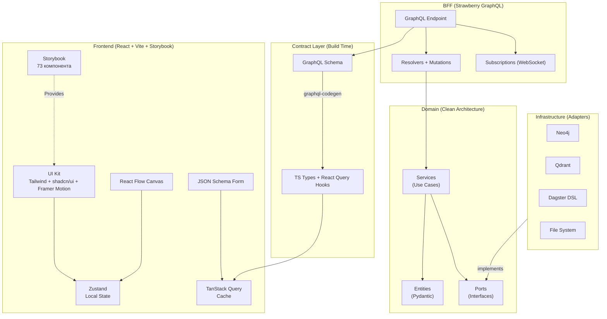

# Технологический стек UI-платформы

Ниже представлен продуманный список фреймворков и библиотек для построения надежной, типобезопасной (End-to-End Type Safety) и модульной платформы на базе React, Zod и FastAPI.

---

## 1. Frontend (React Ecosystem)

Поскольку мы строим два сложных приложения (DAG Builder и Knowledge Base), нам нужен строгий контроль состояния, форм и стилей.

### 1.1. Core & Architecture
* **React 18+** — базовый фреймворк.
* **Vite** — сверхбыстрый сборщик. Обеспечивает мгновенный HMR (Hot Module Replacement) при разработке, что критично для сложного UI.
* **pnpm workspaces** (или Turborepo) — для управления monorepo. Позволяет вынести общие компоненты в `packages/shared`, а приложения держать в `apps/dag_builder` и `apps/knowledge_base`.
* **TypeScript** — строгая типизация (обязательно "strict": true).

### 1.2. Graph & Visualization
* **`@xyflow/react` (React Flow v12)** — ядро для отрисовки обоих графов (пайплайны и Neo4j).
* **`dagre` или `elkjs`** — движки для автоматического лейаута графов.

> [!NOTE]
> Визуальные стандарты нод, ребер, цветовая палитра и эстетика (в стиле Python `diagrams`) вынесены в отдельный документ [UXUI_DESIGN.md](file:///d:/repo/airflow/habr/ui/UXUI_DESIGN.md).

### 1.3. State Management & Data Fetching
* **Zustand** — легковесный, предсказуемый стейт-менеджер. React Flow официально рекомендует Zustand для хранения состояния нод и связей. Не требует boilerplate-кода (в отличие от Redux).
* **TanStack Query (React Query)** — стандарт де-факто для работы с API. Работает с кэшированием, инвалидацией, состоянием загрузки/ошибки (ideally for polling / auto-refetching).

### 1.4. Forms, Validation & Schemas
Поскольку ядро DAG-билдера — это конфигурация шагов, этот слой должен быть пуленепробиваемым.
* **Zod** (`zod`) — валидация данных на клиенте.
* **React Hook Form** (`react-hook-form`) — производительная работа с формами без лишних ререндеров сложного графа.
* **`@hookform/resolvers/zod`** — мост между Zod и React Hook Form.
* **`@rjsf/core` (React JSON Schema Form)** — **критически важная библиотека**. Она позволяет автоматически рендерить UI-формы (input, select, boolean) получая JSON Schema от бэкенда (из Pydantic-моделей Dagster).
* **Monaco Editor** (`@monaco-editor/react`) — встраиваемый редактор кода (как в VS Code) для YAML-панели с поддержкой синтаксиса и маркеров ошибок.

### 1.5. Styling, Animations & Component Catalog
Дизайн-система — фундамент для микрофронтендов. Нам необходимы гибкость, надежность и премиальный UX.
* **Tailwind CSS** — утилитарный CSS-фреймворк. Позволяет быстро стилизовать сложный интерфейс прямо в разметке. Хорошо комбинируется с темной/светлой темой React Flow.
* **Framer Motion** — индустриальный стандарт для анимаций в экосистеме React.
  - **Зачем**: Плавный UX. Анимации появления боковых панелей (Inspector Slide-in), аккордеонов, раскрытия узлов дерева (RAPTOR Tree), микро-интеракции при наведении или Drag-and-Drop операциях.
* **Storybook** — изолированная среда для разработки и документирования UI-компонентов.
  - **Зачем**: Единый каталог для всей дизайн-системы микрофронтендов. Позволяет разрабатывать кнопки, бейджи, формы и **даже изолированные карточки кастомных нод React Flow** в отрыве от основного приложения. Упрощает тестирование, визуальный регресс и ознакомление с компонентами.
* **`lucide-react`** — современный, чистый набор иконок для кнопок, бейджей и тулбаров нод.
* **`react-diff-viewer-continued`** — для отображения разницы (diff) между версиями YAML и текстами чанков.
* **`react-markdown`** — для рендеринга текстов статей и описаний концептов в Detail Panel.
* **Radix UI** или **shadcn/ui** — набор нестилизованных, доступных (A11y) примитивов. Идеально для сборки кастомного каталога в Storybook.

## 2. Backend (GraphQL Federation v2 + Clean Architecture)

Серверная часть следует принципам **Clean Architecture** с **GraphQL Federation v2** (3 subgraphs + Apollo Router). Подробная архитектура: [BACKEND_ARCHITECTURE.md](file:///d:/repo/airflow/habr/ui/BACKEND_ARCHITECTURE.md).

### 2.1. Gateway & Transport
* **Apollo Router** — Federation v2 gateway. Единая точка входа для фронтенда.
* **Strawberry GraphQL** + `strawberry.federation` — type-safe Federation subgraphs с `@key`, `resolve_reference`, stubs.
* **FastAPI** — ASGI-хост для каждого subgraph + health/metrics.
* **Uvicorn** — асинхронный сервер.

### 2.2. Domain & Validation
* **Pydantic v2** — доменные модели (entities), валидация, JSON Schema генерация для фронтенд-форм.

### 2.3. End-to-End Type Safety (Килер-фича)
* **GraphQL Code Generator** (`@graphql-codegen/cli`) — заменяет Orval/openapi-typescript. Берет GraphQL-схему от Strawberry и генерирует TypeScript-типы + React Query хуки для каждого `.graphql`-файла на фронтенде. Один источник истины: Pydantic → Strawberry → TS.

### 2.4. Infrastructure (Adapters)
* **`neo4j` async driver** — графовая БД (Cypher).
* **`qdrant-client`** — векторная БД.
* **`dagster-dsl`** (наш пакет) — StepRegistry, ConfigUtils, PipelineRunner.
* **`ruamel.yaml`** — round-trip YAML.

---

## 3. Архитектурная схема

> [!NOTE]
> Полный каталог компонентов для Storybook (73 компонента, ~275 stories) описан в [STORYBOOK_CATALOG.md](file:///d:/repo/airflow/habr/ui/STORYBOOK_CATALOG.md).

